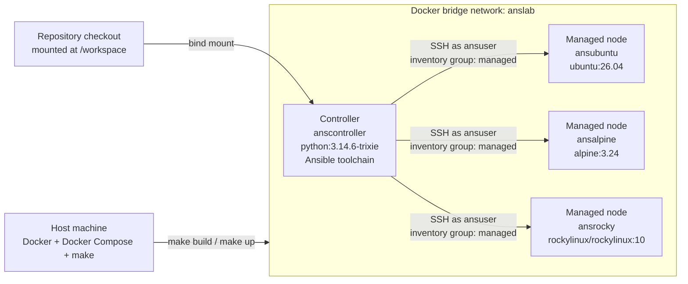

# Ansible Docker Lab

A reproducible Ansible practice lab with one controller container and three managed Linux nodes.

The host only needs Docker and Docker Compose. Ansible, ansible-lint, Molecule, yamllint, and pre-commit are installed inside the controller image with pinned versions.

## Prerequisites

- [Docker](https://docs.docker.com/engine/install/)
- [Docker Compose](https://docs.docker.com/compose/install/)
- `make`

## Lab Topology

| Role | Base image | Local image | Container | Inventory group | Network |
| --- | --- | --- | --- | --- | --- |
| Controller | `python:3.14.6-trixie` | `anslab/controller` | `anscontroller` | none | `anslab` |
| Managed | `ubuntu:26.04` | `anslab/ubuntu` | `ansubuntu` | `managed` | `anslab` |
| Managed | `alpine:3.24` | `anslab/alpine` | `ansalpine` | `managed` | `anslab` |
| Managed | `rockylinux/rockylinux:10` | `anslab/rocky` | `ansrocky` | `managed` | `anslab` |



The checked-in inventory lives at `inventory/hosts.yml`. The sample playbook lives at `playbooks/site.yml`.

## Pinned Controller Tools

The controller installs these Python packages from `requirements-controller.txt`:

| Tool | Version |
| --- | --- |
| Ansible | `14.1.0` |
| ansible-core | `2.21.1` |
| ansible-lint | `26.6.0` |
| Molecule | `26.6.0` |
| molecule-plugins | `25.8.12` |
| pre-commit | `4.6.0` |
| yamllint | `1.38.0` |

## Usage

Build the images:

```sh
make build
```

Start the lab and wait for SSH health checks:

```sh
make up
```

Bootstrap controller SSH access to the managed nodes:

```sh
make bootstrap
```

Verify connectivity:

```sh
make ping
```

Run the sample playbook:

```sh
make playbook
```

Run YAML, Ansible, Dockerfile, and shell checks:

```sh
make lint
```

Scan built lab images for high and critical vulnerabilities without failing the command for pre-existing upstream CVEs:

```sh
make scan
```

Stop the lab:

```sh
make down
```

Remove containers and anonymous volumes:

```sh
make clean
```

## Working Inside The Controller

Open a shell as `ansuser`:

```sh
docker compose exec controller su - ansuser
```

Then run Ansible commands from `/workspace`:

```sh
cd /workspace
ansible managed -m ping
ansible-playbook playbooks/site.yml
```

## Authentication

Every container has an `ansuser` account with passwordless sudo. The lab password for both `root` and `ansuser` is:

```text
password123
```

This password is intentionally simple for local lab use only. Do not use this setup as-is for production or shared networks.

`script/bootstrap.sh` is idempotent. It creates `/home/ansuser/.ssh/id_ed25519` in the controller if needed, copies the public key to `ansubuntu`, `ansalpine`, and `ansrocky`, and runs an Ansible ping against the `managed` group.

## Files Of Interest

- `docker-compose.yml`: service topology, container names, health checks, and shared network
- `controller/Dockerfile`: pinned controller toolchain
- `ubuntu/Dockerfile`, `alpine/Dockerfile`, `rocky/Dockerfile`: managed node images
- `ansible.cfg`: project Ansible defaults
- `inventory/hosts.yml`: static managed-node inventory
- `playbooks/site.yml`: sample connectivity and sudo validation playbook
- `Makefile`: local workflow commands
